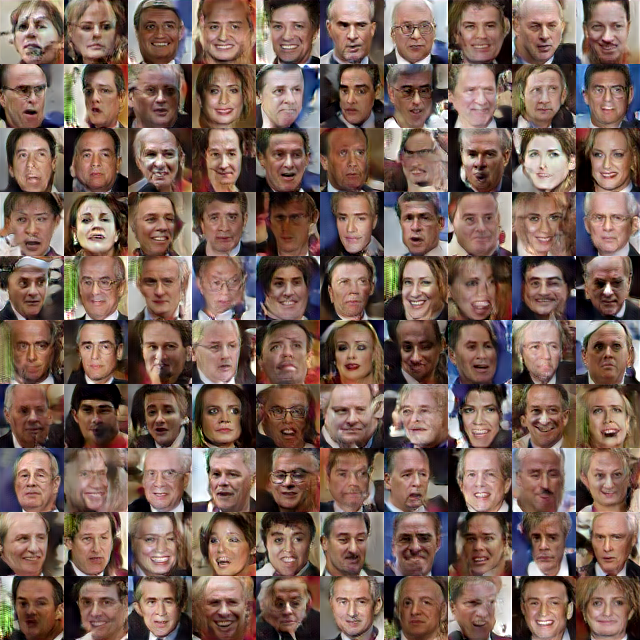

## Torch convolutional GAN
To run the code clone the repository

```
git clone https://github.com/skaae/torch-gan.git
```

`cd` to the `datasets` subfolder and run `create_dataset.py`. This will create the [labeled faces in the wildt dataset](http://vis-www.cs.umass.edu/lfw/). This may take a while depending on your internet connection etc.

Then run

```
th train_lfw.lua -g 0
```

where `-g 0` specifies the GPU you want to use. The code will only run on GPU, but you can easily modify to run on CPU by removing the cudnn dependencies.

The code will plot 100 generated images after each epoch.
After a 5-10 epochs you should see something that looks like a face.

The code was written by [Anders Boesen Lindbo Larsen](https://github.com/andersbll) and [Søren Kaae Sønderby](https://github.com/skaae). Our code is based on code released with the [LAPGAN paper](https://github.com/facebook/eyescream). 

#### Move in latent space
**[Long latent space movie](https://www.youtube.com/watch?v=PmC6ZOaCAOs&feature=youtu.be)**    


#### 100 epochs



##### Dependencies
 *  Torch
 *  numpy
 *  skimage
 *  h5py
 *  [torch hdf5](https://github.com/deepmind/torch-hdf5)
 *  [cudnn for torch](https://github.com/soumith/cudnn.torch)
